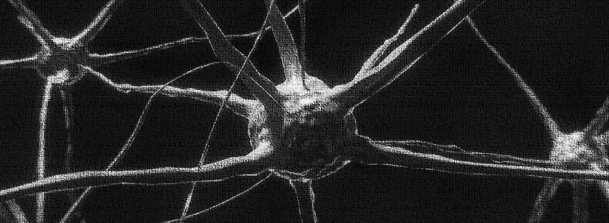

# Nue



A deep learning framework sculpted for seamless implementation of models, geared towards entry level learners.

_Currently in Development, I'll be adding as I learn how to build_

### Quickstart

1. PIP it!

```
$ pip isntall nue
```

2. Test out any of the following models!

- [Linear Regression](https://vxnuaj.github.io/nue/models.html#models-linreg)
- [Logistic Regression](https://vxnuaj.github.io/nue/models.html#models-logreg)
- [A Feedforward Neural Network for Classification](https://vxnuaj.github.io/nue/models.html#models-nn)

### **Phase 1**

- [X]  Linear Regression Model
    - [x]  Implement
    - [X]  Write DocStrings
- [X]  Logistic Regression Model
    - [X]  Implement
    - [X]  Write DocStrings
- [X]  Vanilla Neural Networks
    - [X]  Implement
    - [X]  Write DocStrings

**Organize**

- [ ]  Optimize performance of each model
    - [ ]  Tune the operations and architecture (code)
- [ ]  Implement scaling / standardization functions
- [ ]  Ship ‘pip install neo_dl’ functionality once a stable version is released.
- [ ]  Implement a utility function that allows for easy split of test/train of csv data.
- [ ]  Functionality for loading params from a pkl file.
- [ ]  Functionality for saving params from a pkl file
- [ ]  Functionality for securely storing params other than a pkl file
- [ ]  Functionality for saving params securely other than a pkl file
- [ ]  Implement Loading Bar whilst the model is training
- [ ]  Implement __init__.py functionality under /nue for ease of import for users.